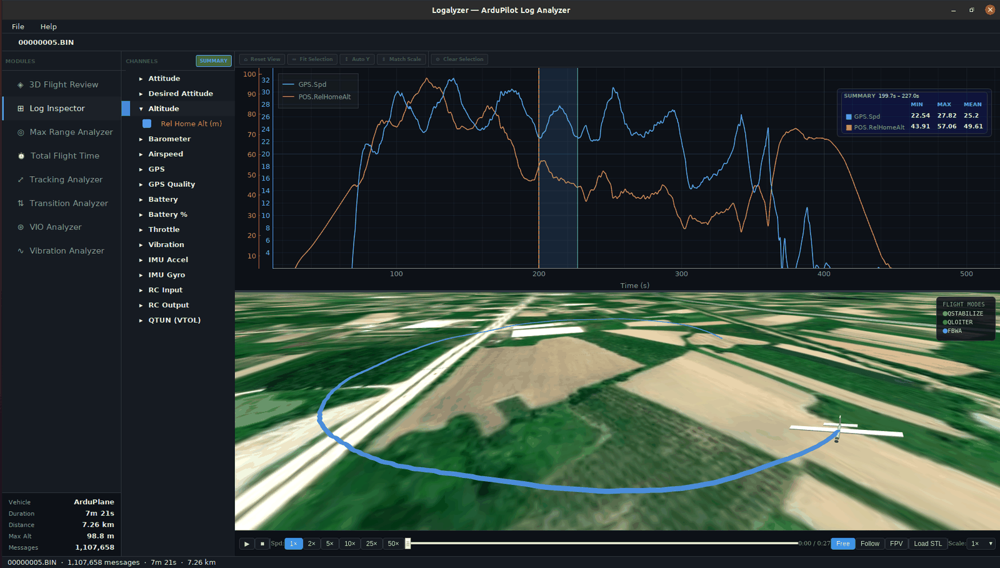
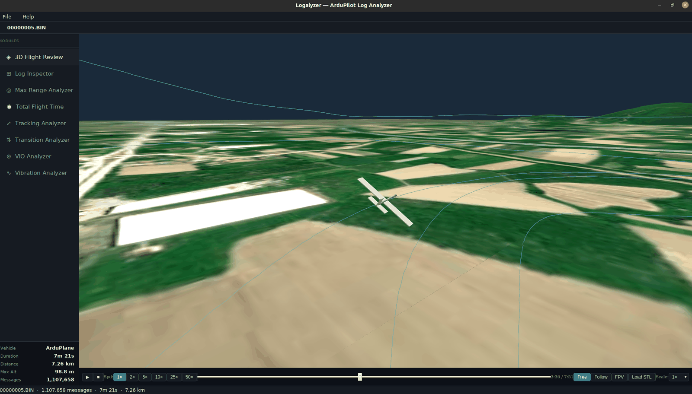
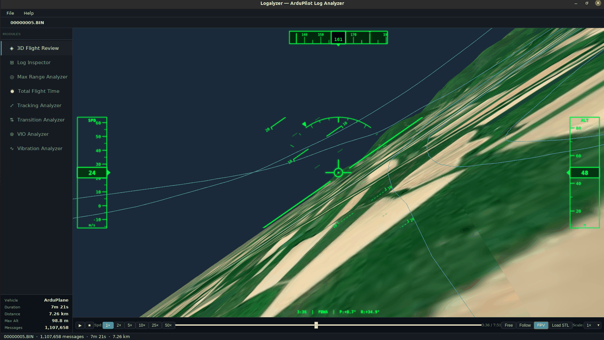
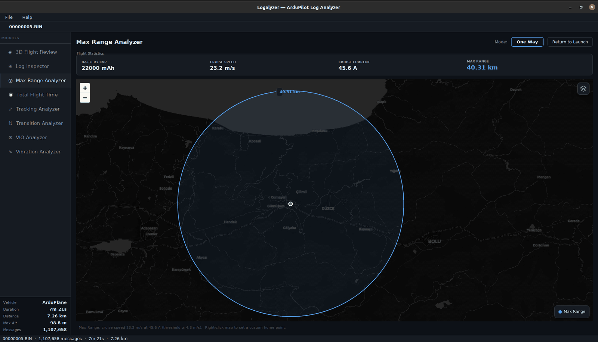
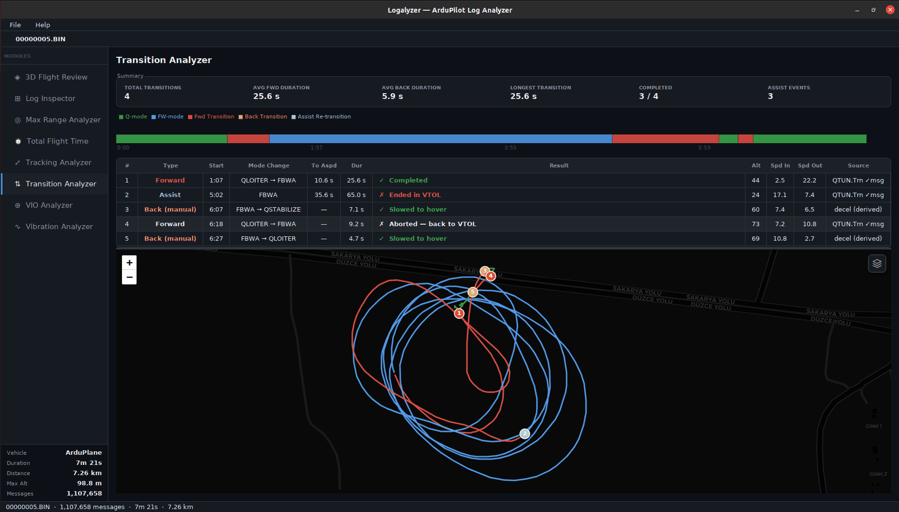
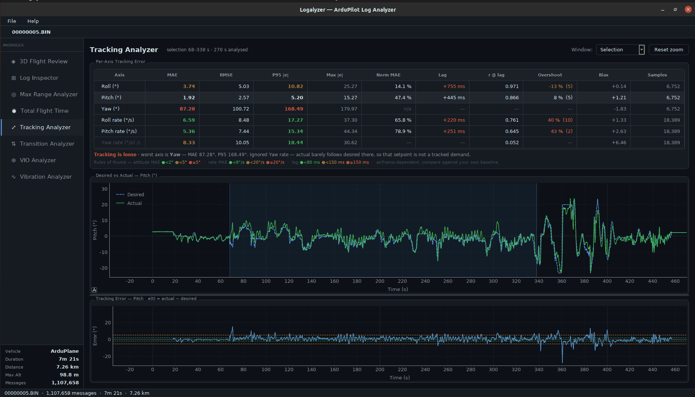
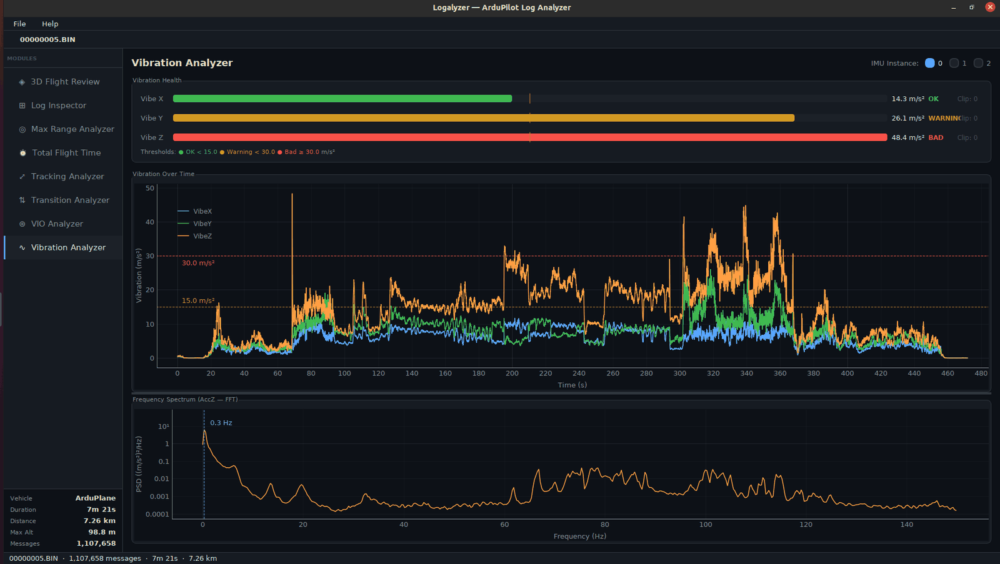

<p align="center">
  
</p>

<p align="center">
  A desktop application for analyzing ArduPilot flight logs (.BIN / .log).<br>
  Load a log and explore flight data through focused analysis modules — all offline, no cloud upload required.
</p>

<p align="center">
  
  
  
  <a href="https://github.com/erendernalar/logalyzer/releases/latest"></a>
</p>

<p align="center">
  <a href="https://github.com/erendernalar/logalyzer/releases/latest">Download for Windows</a> — no Python install required
</p>

---

## Screenshots

| | |
|---|---|
| **Log Inspector** — synchronized time-series graphs + 3D flight path map |  |
| **3D Flight Review** — free-camera terrain replay |  |
| **3D Flight Review** — FPV HUD mode |  |
| **Max Range Analyzer** — estimated range plotted on the map |  |
| **Transition Analyzer** — VTOL transition events + color-coded path |  |
| **Tracking Analyzer** — desired vs actual tracking error per axis |  |
| **Vibration Analyzer** — IMU vibration health + FFT spectrum |  |

---

## Features

| Module | Description |
|---|---|
| **Log Inspector** | Interactive time-series graphs (attitude, altitude, battery, vibration, RC output) with a synchronized 3D flight path map |
| **3D Flight Review** | Replay flight over 3D terrain with a full FPV HUD — heading tape, speed/altitude tapes, pitch ladder, roll arc |
| **Vibration Analyzer** | IMU vibration health bars and FFT frequency spectrum per axis |
| **Tracking Analyzer** | Scores desired-vs-actual tracking per axis for tuning — MAE, RMSE, P95 error, response lag and step overshoot |
| **Max Range Analyzer** | Estimates maximum one-way / return-to-launch range from cruise speed and battery data; plotted on an interactive map |
| **Transition Analyzer** | VTOL transition event table with durations, color-coded flight path (Q-mode / forward flight / transition phases) |
| **VIO Analyzer** | Compares visual-inertial odometry (VIO) path against the GPS flight path on a synchronized 3D map |
| **Total Flight Time** | Scans a folder of logs and calculates cumulative airtime across all flights |

---

## Requirements

- Python 3.8 or newer
- A desktop OS with a display (Windows, Linux, macOS)

### System dependencies (Linux only)

On Ubuntu/Debian you need the Qt WebEngine runtime libraries:

```bash
sudo apt-get install python3-pyqt5.qtwebengine
```

---

## Installation

```bash
# 1. Clone the repository
git clone https://github.com/erendernalar/logalyzer.git
cd logalyzer

# 2. Create and activate a virtual environment (recommended)
python3 -m venv .venv
source .venv/bin/activate        # Linux / macOS
.venv\Scripts\activate           # Windows

# 3. Install Python dependencies
pip install -r requirements.txt

# 4. Run
python main.py
```

---

## Usage

### Opening a log

1. Click **Open Log** in the toolbar (or drag-and-drop a `.BIN` / `.log` file onto the window).
2. The sidebar lists all available analysis modules. Click any module to load it.

### Log Inspector

- The left panel shows a tree of available data groups (Attitude, GPS, Battery, etc.).
- Check a group to plot its channels on the time-series graph.
- The map on the right displays the GPS track; a vertical cursor syncs between the graph and the map as you hover.

### 3D Flight Review

- Use the **Free / Follow / FPV** camera buttons to switch view modes.
- In **FPV** mode a full HUD overlay is shown: heading tape, speed tape, altitude tape, pitch ladder, and roll arc.
- Press **Play** (▶) to replay the flight in real time. Use **1×, 2×, 4×** to change playback speed.
- Drag the timeline slider to jump to any point in the flight.
- Use **+** / **−** to scale the aircraft model size.

### Tracking Analyzer

- Scores how closely each axis follows its setpoint, from `ATT` (attitude) and `RATE` (body rates).
- Metrics per axis: **MAE** (overall tracking error), **RMSE** (weights big misses harder), **P95 |e|**
  (how bad the hard parts get, spike-resistant), **Max |e|**, **Norm MAE** (error ÷ mean |desired|,
  ignoring the near-zero-setpoint stretches, so flights of different intensity compare), **Lag**
  (cross-correlation delay), **r @ lag** and **Overshoot** after fast setpoint steps.
  Mean signed error appears only as a **Bias** trim hint — on its own it cancels out and says nothing.
- **Window** selects what is scored: armed intervals only, the full log, or drag the shaded region on
  the plot to score one stretch.
- Click a table row to plot that axis: desired vs actual on top, `e(t)` below with ±MAE and ±P95 bands.
- Axes marked **⚠** are excluded from the verdict — actual barely correlates with desired there, so
  that setpoint was never a tracked demand (ArduPlane's `DesYaw` is the usual case).

### Max Range Analyzer

- After loading a log the module shows the estimated range on an interactive map as a single circle.
- Toggle **One Way** / **Return to Launch** to switch between the full range and the safe return radius.
- Right-click anywhere on the map to move the home point to that location.

### Transition Analyzer

*(VTOL aircraft only)* — Shows a table of every Q↔Fixed-wing transition with timestamps and duration, plus a color-coded flight path on the map (green = Q-mode, blue = fixed-wing, red = forward transition, orange = back transition).

### VIO Analyzer

*(requires a VIO/visual-odometry source in the log)* — Overlays the estimated VIO path against the GPS track on the 3D map so drift and divergence between the two are easy to spot.

### Total Flight Time

- Click **Select Folder** and choose a directory that contains `.BIN` or `.log` files.
- The module scans all logs recursively and shows per-file airtime and a cumulative total.

---

## Project structure

```
logalyzer/
├── main.py                         # Entry point
├── requirements.txt
├── app/
│   ├── assets/                     # Bundled JS/CSS libraries and icons
│   ├── core/
│   │   ├── log_loader.py           # pymavlink-based BIN parser
│   │   ├── log_data.py             # Parsed log data container
│   │   └── module_registry.py      # Discovers and registers modules
│   ├── modules/
│   │   ├── base_module.py          # Abstract base class for all modules
│   │   ├── log_inspector/
│   │   ├── flight_review_3d/
│   │   ├── vibration_analyzer/
│   │   ├── tracking_analyzer/
│   │   ├── max_range_analyzer/
│   │   ├── transition_analyzer/
│   │   ├── vio_analyzer/
│   │   └── total_flight_time/
│   ├── ui/                         # Main window and shared UI widgets
│   └── theme/                      # Dark theme stylesheet and color palette
```

---

## Adding a custom module

1. Create a new directory under `app/modules/your_module/`.
2. Add an `__init__.py` (can be empty).
3. Create `module.py` with a class that inherits from `BaseModule`:

```python
from app.modules.base_module import BaseModule

class YourModule(BaseModule):
    DISPLAY_NAME = "Your Module"
    DESCRIPTION  = "What it does"

    def get_widget(self):
        # Return a QWidget to display
        ...

    def load_log(self, log):
        # Called with a LogData object when the user opens a log
        ...
```

4. Register it in `app/core/module_registry.py` — the module will appear automatically in the sidebar.

---

## Supported log formats

| Format | Source |
|---|---|
| `.BIN` | ArduPilot DataFlash binary log |
| `.log` | ArduPilot DataFlash text log |

Logs from **ArduPlane**, **ArduCopter**, **ArduRover**, and **VTOL** (QuadPlane) vehicles are all supported. VTOL-specific modules (Transition Analyzer) show additional data when Q-mode messages are present.

---

## Dependencies

| Package | Purpose |
|---|---|
| `pymavlink` | Parsing `.BIN` / `.log` ArduPilot logs |
| `PyQt5` | GUI framework |
| `PyQtWebEngine` | Embedded Leaflet and Three.js maps |
| `pyqtgraph` | Fast time-series plotting |
| `numpy` | Numerical data processing |
| `scipy` | FFT and signal processing (vibration module) |
| `pandas` | Tabular data handling |

---

## License

This project is released under a **Non-Commercial Open Source License**.

- **Free to use** for personal, educational, and open-source projects
- **Commercial use is prohibited** — you may not sell, license, or use this software in any revenue-generating product or service without written permission
- **Copyleft** — any modified or derivative work must be distributed under the same license with full source code made publicly available
- **Attribution required** — credit must be given to the original author

See [LICENSE](LICENSE) for the full terms.
For commercial licensing, contact: erendernalar@gmail.com
